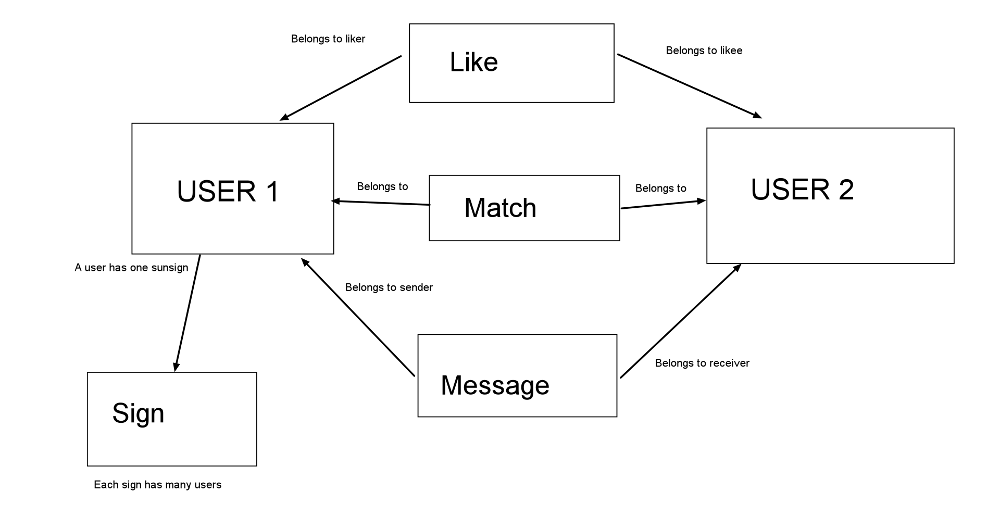

# Project Overview
For this project I want to make a dating app, with an astrology spin. So that users can find each other according to their star signs and horoscopes. I thought it would be a fun way to show everything I've learned while at Flatiron, while playing around with some frontend and backend skills that I want to expand on. The styling will be done in Semantic UI.

### The Frontend:

Here's the link to the backend repo: https://github.com/MitchellGoodwin/Star-Crosser-Frontend

Details related to it's structure are in the ReadMe there.

# Models

As of now I see my schema as being like this:
* Users
* SunSigns
And then three self join tables between users:
* Likes
* Matches
* Messages

### Relationships:

A User is going to belong to one SunSign, which will have many users.

I'm calling the sign SunSign to start with, because eventually I would like to incorporate more signs, so I don't have to rename the model everywhere again later, if I incorporate that.

At that point a user will have one birth chart, which will belong to a SunSign, a MoonSign etc..

-------

A like will belong to a liker and a likee as I will need to know who is who in that relationship.

Similarily a message will belong to sender and sendee for similar reasons.

A match will belong to probably a user1 and user2, as it's less important.

#### ON MATCH:

I'm a litle unsure of which is the best way to implement logic for matches. I want a match to be made when the two users like each other. So the different ways I could see doing it are:
* Don't even have a match join table. Just have a matches route that filters for users that you've both liked each other (likely inefficient?)
* When both parties like each other, make a corrisponding match join.
* When both parties like each other, make a corrisponding match join, and also delete the likes (to make my data less redundant).

I'm leaning towards the third being the best, but I feel like I could be wrong.

## User

I'm planning for my user to have a lot of variables, which makes sense. The purpose of the app is to match different users with each other, so a lot of focus is on user data. 

The variables are:

* email

* firstName

* lastName

* password_digest

* location

* age (maybe don't need, because of birthday)

* birthDate

* picture

* gender

* lookingFor    (gender preference)

* sunSign

I also want them to have different sections on their bio, so they will be handled by different variables

* bioIntro

* bioGeneral

* bioFood

* bioMusic

* bioMovies

* bioBooks

* bioActivities

* bioGoals

## Backend Routes
------

#### Users:

* Create:

This is for user signup.

Needs an Email, Password, Gender, LookingFor, Location, and Birthday

Renders and auth token, and the new user.

* Update:

For when the current user wants to update their own profile.

It will ask for most info related to the user, and then render that user.

* Index:

This is for the current user looking up other users. So it will filter all users according to gender and the other users looking for matching the current user, as well as filtering out the current user. Then it will render those users, but just enough data to render cards on the front end, instead of a full profile.

* Show:

This is for a users profile page. It will render most of their related information, minus security stuff.

------

#### Sessions:

* create/login

renders the user and auth_token

* show

For checking the current user when there is an auth token when the app starts.

Renders the user for the received auth_token

------

#### Likes:

* create

Needs a user2 id in the params.

Creates a like and/or match depending on if that user2 has already liked the current user yet or not.

Renders the new like or match.

* destroy

Needs a like id. It then deletes that related like.

* index

Renders all of the current user's liked users.

------

#### Matches:

Theoretically doesn't need a create route, as the LikesController will handle that.

* Destroy

Same as likes route.

* Index

Same as likes route.

------

#### Messages:

* Create

Needs a user2 id, and message text.
Renders either this message, or all of the messages between these two users.

* Index

Needs a user2 id.
Renders all of the messages for the current user and the selected user, sorted by time.

------

#### Sign:

Shows the sign's details.

# Technologies expected to use.

* zodiacal.herokuapp.com

For seeding sign info.

* api.vedicrishistro.com/v1/planets

For finding a user's sign/signs.

* Aztro api

For finding the current user's horoscope.

* randomuser.me/api

For seeding random users with more realistic profile pics.

* Geokit gem

For finding distance between users. As well as birth location latitude and longitude for advanced sign searching.

* Figaro gem?

A gem for environment variables.

# MVP daily plan

## Wednesday Afternoon

* Start Backend
* Create Models as Described in Preposal
* Implement Auth
* Seed From APIs

## Thursday

* Start Frontend
* Setup Routes
* Redux Setup
* Create Homepage
* Auth Forms/Routes

## Friday

* My Profile Form
* User Show Page
* Star Sign show

## Monday

* Explore Other Users
* Can Click to go to Show
* Can Like/Unlike
* Matches Setup

## Tuesday

* Inbox Setup
* Can See All Likes and Matches
* Can Message And See All Previous Messages

# Stretch Goals for Full Project

* Can look up full birthchart
* Can fill out a personality quiz
* Can sort users by astronomy or personality quiz- style it as science vs astrology
* WEBSOCKETS
* Email Integration
* Add a subscription setup with real payment integration
* Add restrictions for if not subscribed
* Add an ability to block users
* Add uploading photo files
